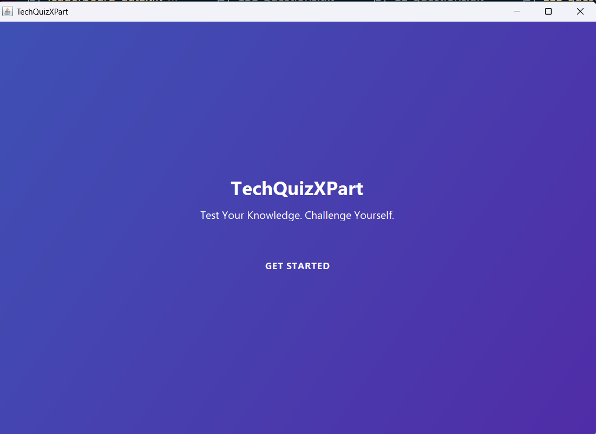

# TechQuizXPart - Elegant Quiz Application 🚀

 

## 🌟 Features

- **Department-wise Quizzes**: CSE, EEE, CE, and ME departments with subject-specific questions
- **Beautiful Modern UI**: Clean, professional design with smooth animations
- **Leaderboard System**: Track top performers by subject
- **Question Contribution**: Users can add new questions to expand the quiz bank
- **Timed Questions**: Challenge yourself with a countdown timer
- **Persistent Data**: All questions and scores are saved between sessions

## 🛠️ Technologies Used

- **Java Swing** for the elegant desktop interface
- **File-based Storage** for questions and leaderboard data
- **Object-Oriented Design** following SOLID principles
- **Modern UI Patterns** with cards, animations, and responsive layouts

## 🚀 Getting Started

### Prerequisites
- Java 8 or higher
- Maven (for building)

### Installation
1. Clone the repository:
   ```bash
   git clone https://github.com/yourusername/TechQuizXPart.git
   ```
2. Navigate to the project directory:
   ```bash
   cd TechQuizXPart
   ```
3. Compile and run:
   ```bash
   javac src/ui/TechQuizXPart.java
   java src.ui.TechQuizXPart
   ```

## 📂 File Structure
```
TechQuizXPart/
├── questions/               # Department question files
│   ├── CSE_questions.txt
│   ├── EEE_questions.txt
│   ├── CE_questions.txt
│   └── ME_questions.txt
├── src/
│   ├── model/               # Core application classes
│   │   ├── LeaderBoard.java
│   │   ├── Question.java
│   │   ├── QuestionRepository.java
│   │   ├── Quiz.java
│   │   ├── Subject.java
│   │   └── User.java
│   └── ui/                  # Beautiful Swing interface
│       └── TechQuizXPart.java
├── icon.png                 # Application icon

```

## 🎨 UI Design Highlights

- **Color Scheme**:
  - Primary: Deep Blue (#3F51B5)
  - Accent: Orange (#FF9800)
  - Background: Light Gray (#FAFAFA)

- **Typography**:
  - Titles: Segoe UI Bold 28pt
  - Body: Segoe UI 16pt
  - Buttons: Segoe UI Bold 14pt

- **Animations**:
  - Fade-in effects on screen transitions
  - Hover states for interactive elements
  - Smooth progress bars for timers

## 📝 How to Use

1. **Create Your Profile**:
   - Enter your name, university, and select department/subject

2. **Take a Quiz**:
   - Answer 5 random questions from your selected subject
   - Each question has a 10-second timer
   - Earn points for correct answers

3. **Add Questions**:
   - Contribute to the question bank
   - Questions are saved to your department's file

4. **View Leaderboard**:
   - See top scores by subject
   - Your scores are automatically recorded

## 📊 Scoring System

- **Correct Answer**: +1 point
- **Wrong Answer**: -0.5 points
- **No Answer**: 0 points

## 🤝 Contributing

We welcome contributions! Here's how:

1. Fork the project
2. Create your feature branch (`git checkout -b feature/AmazingFeature`)
3. Commit your changes (`git commit -m 'Add some amazing feature'`)
4. Push to the branch (`git push origin feature/AmazingFeature`)
5. Open a Pull Request

## 📜 License

Distributed under the MIT License. See `LICENSE` for more information.

## ✉️ Contact


Project Link: [https://github.com/yourusername/TechQuizXPart](https://github.com/yourusername/TechQuizXPart)

---

<div align="center">
  Made with ❤️ and Java Swing
</div>